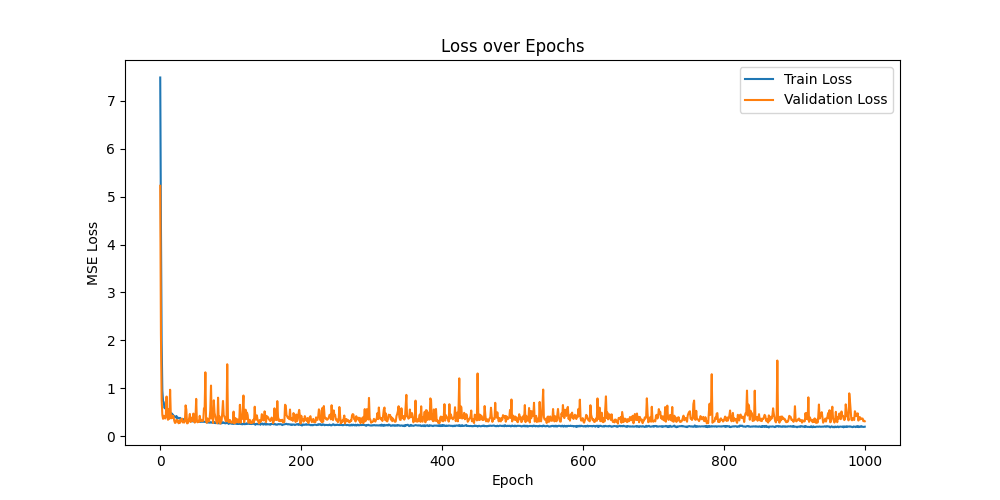
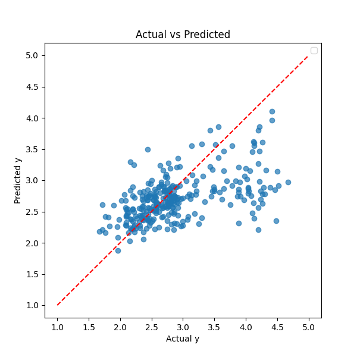

# Introduction

Everyone desires an attractive face. I believe that the reason everyone desires it is that it makes life in society a little easier. Oosterhof and Todorov (2008) demonstrated that facial evaluations have significant social impacts, influencing outcomes such as electoral success and legal judgments. In similar way, we strive to enhance our appearance and present ourselves in the best possible way to others, to take the benefits from it. However, receiving an objective evaluation of one’s appearance is not easy. Since appearance plays a significant role in society, judging someone’s face can often be sensitive, as it may be perceived as assessing their overall worth. Nevertheless, I believe that an absolute standard of beauty does exist. Prokopakis et al.. (2013) propose that the characteristics of an attractive face follow the golden ratio. Based on this, I considered the possibility of developing a technology that evaluates facial appearance solely using the golden ratio for prediction. This technology was expected to offer two key advantages. First, since calculating facial proportions is relatively straightforward with computer vision technology, it provides a fast and efficient method for objective facial evaluation. Second, this technology could serve as a valuable tool for platforms such as dating apps, helping to assess facial attractiveness more systematically. Therefore, the goal of this project is to develop an AI that evaluates appearance based on the golden ratio and to examine the correlation between the two using DNN (Deep Neural Network).

# Dataset

The SCUT-FBP5500 dataset contains facial photos of Asians and Caucasians categorized by gender, along with ratings from 60 evaluators for each photo. The ratings range from 1 to 5, allowing for the analysis of facial attractiveness or other characteristics based on the evaluators' opinions. This dataset can be used for research on facial aesthetics or to model various facial evaluation criteria. Since I am an Asian male, my goal was to predict the evaluations for Asian males. Therefore, I used data from 2,000 Asian males, with 60 evaluators providing ratings, resulting in a dataset with a total of 120,000 rows.

# Methodology

First, I averaged the 60 evaluations for each person, reducing the 120,000 rows to 2,000 rows, one for each person. This is what the first Python file does. Then, using Mediapipe and OpenCV, I extracted the landmarks from each person’s photo and identified key points and lines that are meaningful for calculating the golden ratio. I used points based on the paper mentioned above to measure the golden ratio; a total of 15 points. This is done in the second Python file. I used the 15 key points as input data and the facial evaluation scores as output data to train a model using DNN. The reason I used DNN is that I believed it could capture the nonlinear relationships between the golden ratio. Each person may have parts of their face with a good golden ratio and others with a less favorable one. The face score corresponding to these ratios, where some are good and others are not, is not likely to follow a linear relationship. Therefore, I thought that using DNN, which is strong at making nonlinear predictions, would be the best choice for this task. So, the network architecture had 16, 63, 32, and 1 units in each layer, respectively. I calculated the loss using MSE and applied Leaky ReLU activation (alpha = 0.01) along with the Adam optimizer. The model was trained over 1000 epochs using 16 mini-batches for each training session. The model was trained in the third file of Python. With this model, I created a program that analyzes the evaluation score of a face detected in real time through a webcam using OpenCV and Mediapipe modules. This marked the completion of the project. It is visible in the fourth file: the real-time analysis one.

# Results

After the final epoch, the test MSE reached 0.3592. I have tried modifying various aspects of the DNN, including batch size, activation functions, and the number of nodes in each layer. I also experimented with different methods for calculating the golden ratio. However, achieving a significantly better result beyond this point has proven to be challenging.

As the epochs progressed, the gap between train loss and validation loss widened, and the validation loss fluctuated irregularly. This suggested that the trained model might have been overfitted. To address this, I added an option to save the model with the best predictive performance.

From the Actual vs. Predicted graph, I observed that as the actual **y** values increased, the predicted **y** values tended to decrease proportionally. This implies that the model's predictive power weakened for higher scores, which could be interpreted as a result of excessive normalization. I attempted various methods to reduce this effect, but ultimately, the model still assigned lower predictions to individuals who received higher actual scores. However, the increasing variance was an important aspect to consider. This trend suggests that aesthetic standards may not be entirely objective but rather subjective. While aligning with the golden ratio may enhance facial harmony, the presence of outliers could contribute to a unique charm for some, while not necessarily for others. Observing this increasing variance reinforced my understanding that beauty can be perceived differently depending on individual perspectives.

# Conclusion

This study explored the possibility of evaluating facial attractiveness based on the golden ratio using deep learning techniques. By utilizing the SCUT-FBP5500 dataset, key facial landmarks were extracted and used as input features to train a deep neural network model. The experimental results indicated that while the model was able to learn certain patterns related to the golden ratio, its predictive performance showed limitations, particularly for individuals with higher attractiveness scores. The test MSE reached 0.3592, suggesting that while the model captured some relationships between facial proportions and attractiveness scores, additional factors likely influence human perceptions of beauty beyond the golden ratio. The increasing variance in predictions for higher scores highlights the subjectivity of aesthetic evaluations. Although the golden ratio is often associated with facial harmony, its role in determining attractiveness appears to be only one component of a broader, more complex framework. This finding underscores that while mathematical principles may contribute to our understanding of beauty, personal preferences and cultural differences also play a significant role in shaping aesthetic judgments.

# References

Oosterhof, N. N., & Todorov, A. (2008). The functional basis of face evaluation.*Proceedings of the National Academy of Sciences* ,  *105* (32), 11087-11092

Prokopakis, E. P., Vlastos, I. M., Picavet, V. A., Nolst Trenite, G., Thomas, R., Cingi, C., & Hellings, P. W. (2013). The golden ratio in facial symmetry. *Rhinology, 51* (1), 18–21.
